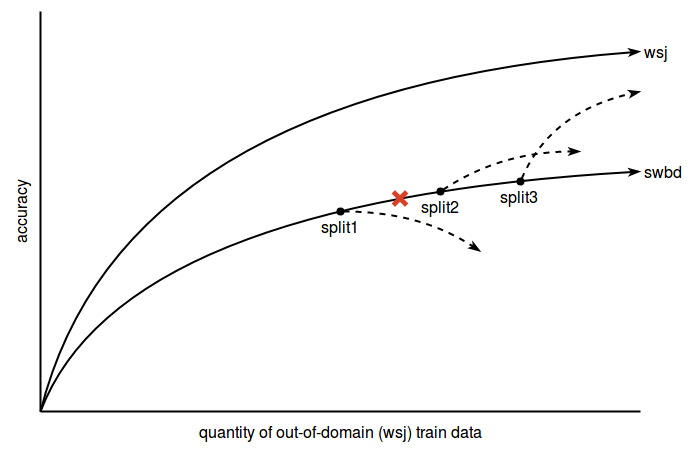
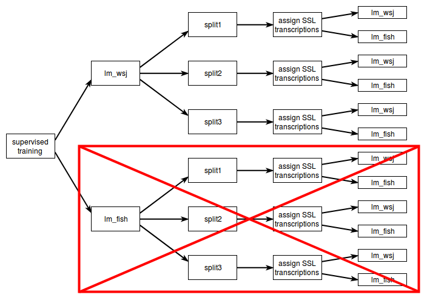
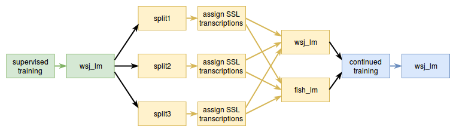

# Domain Adaptation using Semi-Supervised Learning for Speech Recognition

## Datasets

| name        | code | domain  | description       | data           | hours | utts    |
|-------------|------|---------|-------------------|----------------|------:|--------:|
| WSJ         | wsj  | general | news broadcast    | text and audio | 82    | 37,416  |
| Switchboard | swbd | target  | spontaneous phone | audio          | 260   | 264,151 |
| Fisher      | fish | target  | spontaneous phone | text           | N/A   | 762,396 |

## Procedure

 

1. Create 2 LMs, one trained on wsj (wsj_lm), and one trained on fish (fish_lm).

2. Run Kaldi to generate baseline alignments prior to starting Pytorch-Kaldi, trained with wsj_lm.

3. For each LM (only wsj_lm now), train a Pytorch-Kaldi system on wsj for each split (described below). Although only training on a single LM, decode both wsj and swbd with both LMs to generate the solid lines in the graph above.

4. At each of the 3 splits, assign pseudo-transcriptions to a batch of the swbd train data using each of the 2 LMs. This will result in 3 splits x 2 LMs = 6 SSL training experiments (see diagram below).

5. Train model again using incorporated swbd data, decoding with both LMs, reassigning transcriptions to swbd, and incorporating more swbd batches at consistent intervals to generate the dotted lines in the graph above.

6. The aim is to hopefully find the red 'x' in the graph above, the point where SSL would have no effect on the model accuracy, establishing a minimum quantity of data required to benefit from SSL domain adaptation.

## Setup

<!--

-->

 
For now, I'm training baseline model on wsj using wsj_lm, might look into doing it with fish_lm later. Along with split{1, 2, 3} that will be used for SSL, I need to train a model on many splits of wsj, since the x-axis of the curve above is amount of wsj train data. The wsj subsets that I'm going with for now are:

| wsj             | utts  | hours |
|-----------------|------:|------:|
| train_si284_1k  | 1000  | 2.1   |
| train_si284_2k  | 2000  | 4.4   |
| train_si284_3k  |	3000  | 6.4   |
| train_si284_4k  |	4000  | 8.6   |
| train_si284_5k  |	5000  | 10.7  |
| train_si284_10k |	10000 | 20.9  |
| train_si284_15k |	15000 | 32.9  |
| train_si284_20k |	20000 | 44.1  |
| train_si284_25k |	25000 | 55.2  |
| train_si284_30k |	30000 | 66.0  |
| train_si284     | 37416 | 81.5  |

## Results

### baseline with wsj_lang

[table](tables/wsj_lang_table.csv)

### baseline with fish_lang

[table](tables/fish_lang_table.csv)

### ssl

these are all done using the fish_ng decoding results marked with a * in the last column above

| | **swbd.0** | **swbd.1** | **swbd.2** | **swbd.3** | **swbd.4** | **swbd.5** | **swbd.6** | **swbd.7** | **swbd.8** | **swbd.9** |
|----------|--------:|---------:|--------:|---------:|--------:|---------:|--------:|---------:|--------:|---------:|
| **2k**   |	   |       |	   |       |	   |       |	   |       |	   |       |
| **3k**   |	   |       |	   |       |	   |       |	   |       |	   |       |
| **4k**   |	   |       |	   |       |	   |       |	   |       |	   |       |
| **5k**   |	   |       |	   |       |	   |       |	   |       |	   |       |
| **10k**  |	   |       |	   |       |	   |       |	   |       |	   |       |
| **15k**  |	   |       |	   |       |	   |       |	   |       |	   |       |
| **20k**  |	   |       |	   |       |	   |       |	   |       |	   |       |
| **25k**  |       |       |       |       |       |       |       |       |	   |       |
| **30k**  |       |       |       |       |       |       |       |       |	   |       |

